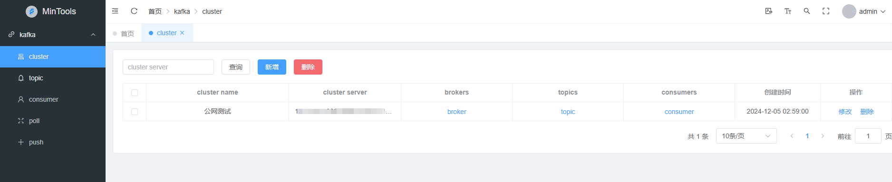
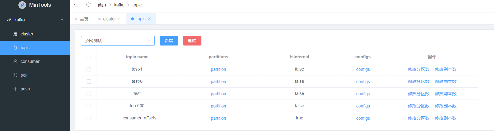
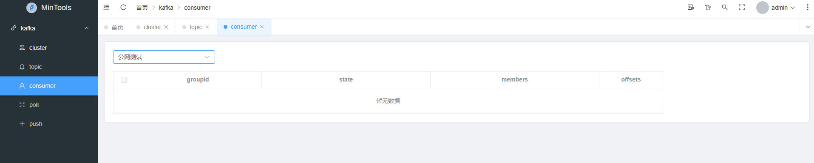
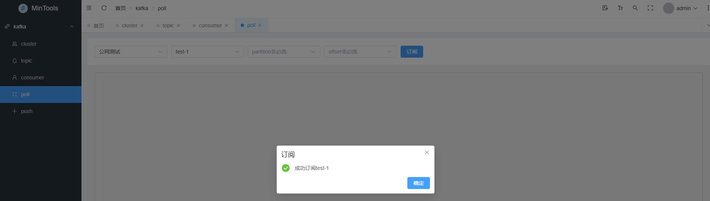
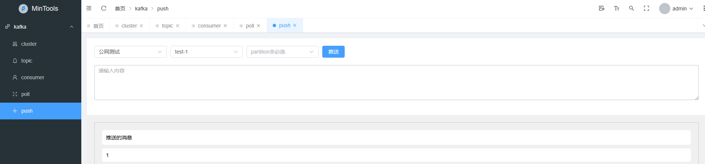

# Kafka Client Tool

该项目提供了一个简单易用的 Kafka 客户端工具，用于连接 Kafka 集群，发送和接收消息。旨在帮助开发者快速集成 Kafka 客户端操作，进行生产环境或测试环境的数据处理。

## 功能

- 支持连接Kafka 集群,查看其broker信息.
- 支持查询topic及其partition信息.
- 支持查看或修改topic的config信息.
- 支持查看topic的consumer.
- 支持修改topic的分区数以及分区副本数.
- 支持消费指定topic消息
- 支持向指定topic推送消息
- ......

## 项目结构
    offset-explorer/
    │ 
    ├── src/
    │   ├── main/ 
    │   │   ├── java/
    │   │   │   └── cn/ 
    │   │   │       └── net/
    │   │   │           └── explorer/
    │   │   │               ├── config
    │   │   │               ├── connector
    │   │   │               └── controller
    │   │   │               └── domain
    │   │   │               └── exception
    │   │   │               └── mapper
    │   │   │               └── service
    │   │   │               └── util
    │   │   │               └── ExplorerApplication.java
    │   └── resources/
    │       └── db
    │       └── mapper
    │       └── application.yml
    │       └── logback-spring.xml
    ├── .gitignore
    ├── pom.xml
    ├── README.md
## docker部署
    #拉取镜像
     docker pull crpi-uf6um9mal0ofi1in.cn-beijing.personal.cr.aliyuncs.com/min_tool/kafka-client:1.0.0

    #运行容器
    docker run -itd -p 8080:8080 -p 80:80 --name kafka-client  -e ENV_USERNAME=admin -e ENV_PASSWORD=123456 crpi-uf6um9mal0ofi1in.cn-beijing.personal.cr.aliyuncs.com/min_tool/kafka-client:1.0.0
   
    #**注**： ENV_USERNAME、ENV_PASSWORD为系统登录用户和密码

## 演示环境地址
   [http://49.232.252.229/](http://)

## 系统界面
 **cluster** 

 **topic** 

 **consumer** 

 **poll** 

 **push** 

## 前端代码
    # https://gitee.com/xingyusix/kafka-client-web.git

## github
    # https://github.com/xy1997/kafka-client.git
    # https://github.com/xy1997/kafka-client-web.git